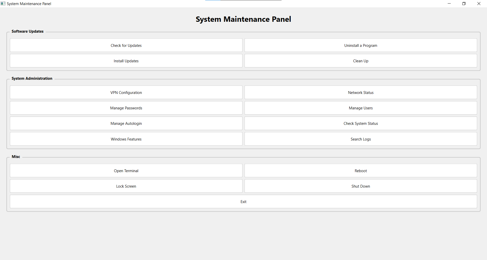

# System Maintenance Panel

A modern, user-friendly GUI application for Windows system maintenance and administration tasks. Built with Python and PyQt6.


## Features

### Software Updates
- **Check for Updates** - Open Windows Update to check for available updates
- **Uninstall a Program** - Launch Programs & Features to remove installed software
- **Install Updates** - Open Windows Update to install pending updates
- **Clean Up** - Launch Disk Cleanup utility to free up disk space

### System Administration
- **VPN Configuration** - Configure VPN connections through Windows settings
- **Network Status** - View network adapter status, speed, and connectivity
- **Manage Passwords** - Access Windows Credential Manager
- **Manage Users** - Create, modify, or remove user accounts
- **Manage Autologin** - Configure automatic login settings
- **Check System Status** - Display detailed system information (CPU, memory, disk space)
- **Windows Features** - Enable or disable Windows optional features
- **Search Logs** - Open Event Viewer to search system logs

### Misc
- **Open Terminal** - Launch PowerShell for advanced commands
- **Reboot** - Restart the system
- **Lock Screen** - Lock your workstation
- **Shut Down** - Power off the system
- **Exit** - Close the application

## Requirements

- Windows 10/11
- Python 3.7 or higher
- PyQt6 6.6.0 or higher

## Installation

1. **Clone or download this repository**
   ```powershell
   git clone https://github.com/Katyusha47/System-Maintenance-Panel.git
   cd System-Maintenance-Panel
   ```

2. **Run the application**
   
   Simply double-click `run.bat` - it will automatically:
   - Check if Python is installed
   - Install PyQt6 if not already installed
   - Launch the System Maintenance Panel

   **Or manually install dependencies:**
   ```powershell
   pip install -r requirements.txt
   ```

## Usage

### Quick Start (Recommended)

Simply **double-click `run.bat`** and the application will launch automatically!

The batch file will handle everything for you:
- ✅ Checks for Python installation
- ✅ Installs dependencies if needed
- ✅ Launches the application

### Manual Launch

If you prefer to run it manually:

```powershell
python system_maintenance_panel.py
```

### Administrator Privileges

The application will prompt you to run with administrator privileges on startup. Many system maintenance tasks require elevated permissions to function properly.

**Functions that require admin rights:**
- Installing Windows updates
- Creating/removing user accounts
- Modifying system settings
- Disk cleanup operations

## Screenshots



The application features a clean, organized interface with three main sections:
- Software Updates (top)
- System Administration (middle)
- Misc (bottom)

Each button opens the appropriate Windows utility or executes the specified system command.

## Safety Features

- **Confirmation Dialogs** - Destructive actions (reboot, shutdown, etc.) require user confirmation
- **Error Handling** - All operations include proper error handling with informative messages
- **Non-blocking UI** - Long-running commands execute in separate threads to keep the UI responsive
- **Timeout Protection** - Commands have a 30-second timeout to prevent hanging

## Technical Details

### Architecture
- **GUI Framework**: PyQt6 for modern, native-looking Windows interface
- **Command Execution**: PowerShell commands executed via subprocess
- **Threading**: QThread for non-blocking command execution
- **Encoding**: UTF-8 with error replacement to handle special characters

### Key Components
- `SystemMaintenancePanel` - Main window class
- `CommandThread` - Worker thread for executing PowerShell commands
- Admin privilege detection and elevation
- Progress dialogs for long-running operations

## Troubleshooting

### "This application requires administrator privileges"
- Click "Yes" when prompted to restart with elevated permissions
- Or right-click the script and select "Run as administrator"

### Commands not working
- Ensure you're running with administrator privileges
- Check that PowerShell is available on your system
- Verify Windows version compatibility (Windows 10/11)

### Unicode/Encoding errors
- The application handles encoding errors automatically
- If issues persist, check your PowerShell encoding settings

## Customization

You can easily customize the application by:
- Adding new buttons in the section layouts
- Creating custom command functions
- Modifying the stylesheet for different colors/themes
- Adjusting window size and layout spacing

## License

This project is provided as-is for educational and personal use.

## Contributing

Feel free to fork, modify, and submit pull requests for improvements!

## Acknowledgments

Built with Python and PyQt6 for the Windows community.

---

**Note**: Always be careful when performing system maintenance tasks. Make sure you understand what each function does before executing it.
